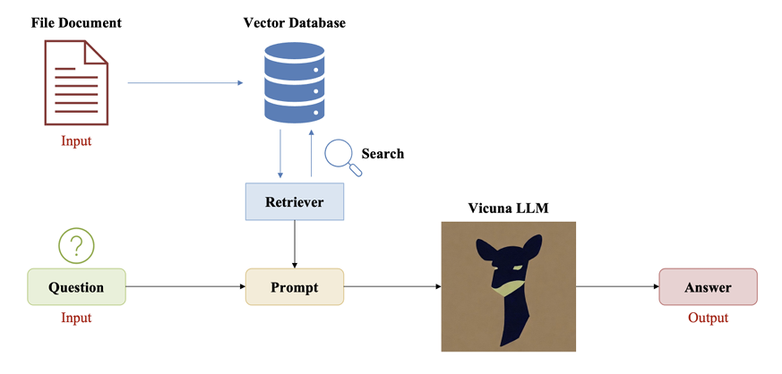
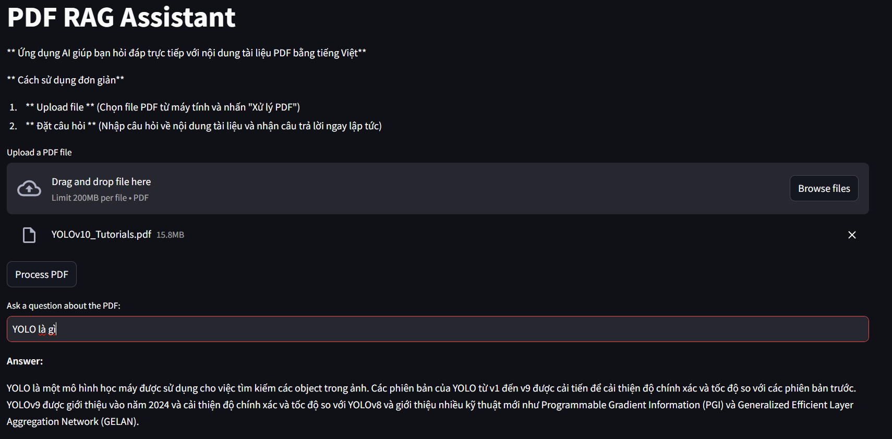

# Ứng dụng Retrieval Augmented Generation (RAG)
## Giới thiệu
Đây là ứng dụng hỏi đáp dựa trên tài liệu dạng PDF đầu vào.\
- Input: 
-- File tài liệu PDF
-- Câu hỏi liên quan tới nội dung FILE
- Output: Câu trả lời\
## Pipeline của chương trình

## Ứng dụng thực tế
